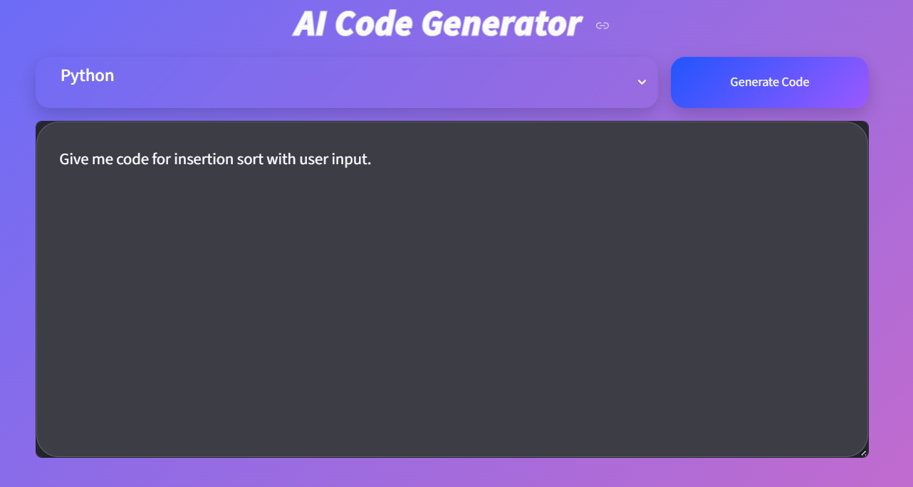
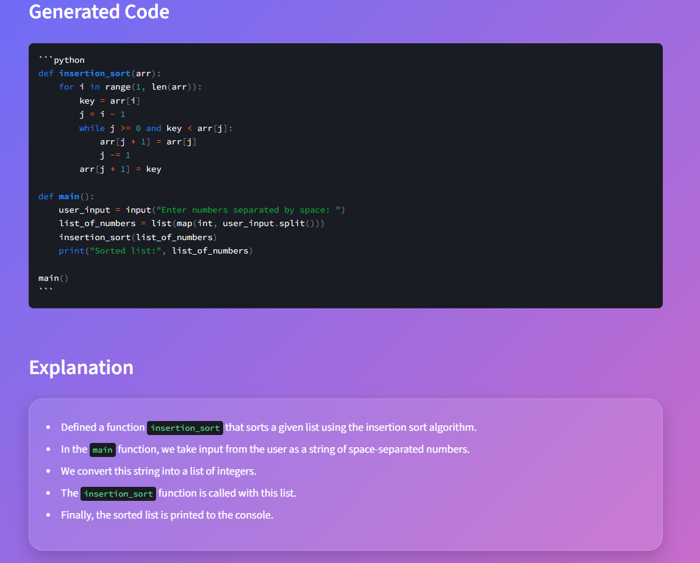

# AI Code Generator
A beginner-friendly AI Code Generator built using:

- Python
- Streamlit
- Ollama
- qwen2.5:7b

This project allows users to generate code in multiple programming languages using a locally running LLM.

# Features
- Generate code using AI
- Beginner-friendly explanations
- Multiple language support
- Modern glassmorphism UI
- Local LLM execution using Ollama
- Simple and clean architecture

# Supported Languages
- Python
- JavaScript
- Java
- C
- C++

# Screenshots

## Home Page


## Generated Code Example



# Tech Stack
| Technology | Purpose |
|---|---|
| Python | Core programming language |
| Streamlit | Frontend UI |
| Ollama | Local LLM runtime |
| qwen2.5:7b | AI model |

# Project Structure
```bash
ai-code-generator/
│
├── app.py
├── utils.py
├── styles.css
├── requirements.txt
├── README.md
└── venv/
```

# Installation

## 1. Clone the Repository
```bash
git clone https://github.com/csumitwr/ai-code-generator.git
cd ai-code-generator
```

## 2. Create Virtual Environment

### Windows
```bash
python -m venv venv
venv\Scripts\activate
```

### Mac/Linux
```bash
python3 -m venv venv
source venv/bin/activate
```

## 3. Install Dependencies
```bash
pip install -r requirements.txt
```

# Install Ollama

Download and install Ollama:

https://ollama.com

Verify installation:

```bash
ollama --version
```

# Download the Model
```bash
ollama pull qwen2.5:7b
```

# Run the Application
Start Streamlit:

```bash
streamlit run app.py
```

The app will open in your browser automatically.

# How It Works
1. User enters a coding request
2. User selects a programming language
3. Streamlit sends the prompt to Ollama
4. qwen2.5:7b generates code
5. The app displays:
   - Generated code
   - Beginner-friendly explanation

# Example Prompt
```text
Create a Python calculator using functions
```

# Future Improvements
- Copy code button
- Download generated code
- Syntax theme selection
- Multiple AI model support
- Chat history
- Dark/light mode toggle

# Important Notes
- Ollama must be running locally
- Internet is not required after model download
- This project uses local AI inference
